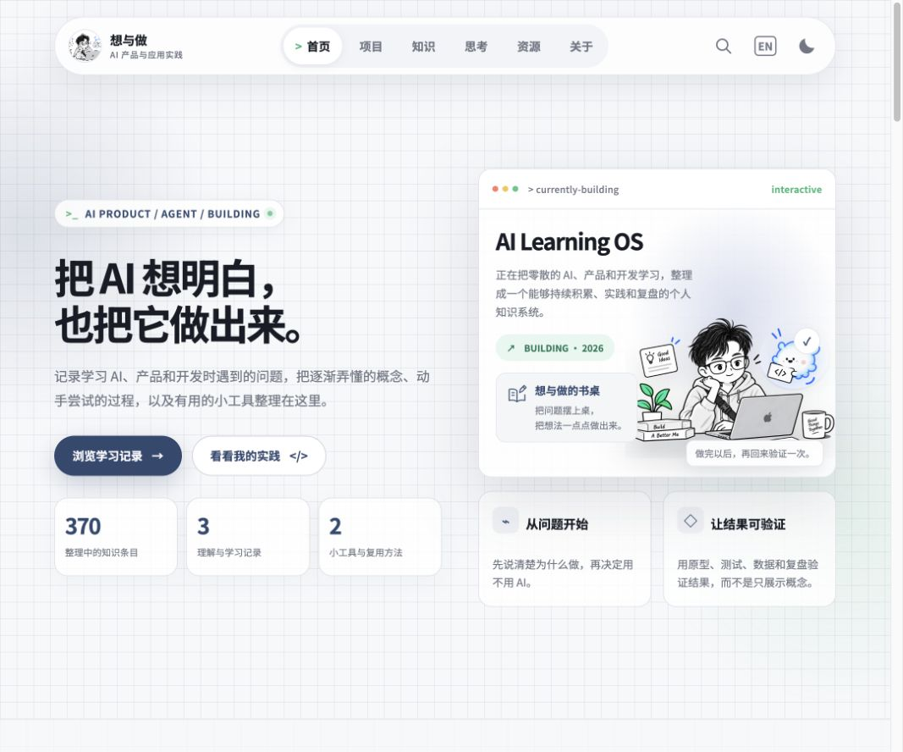
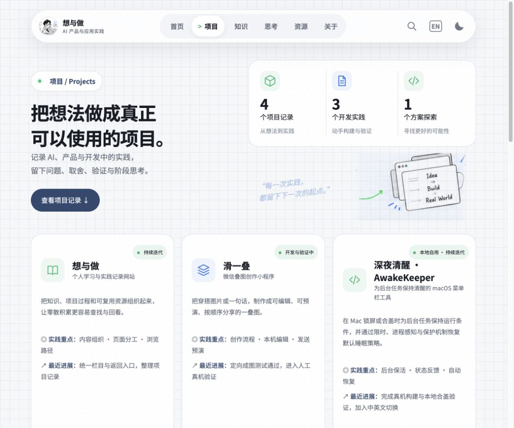
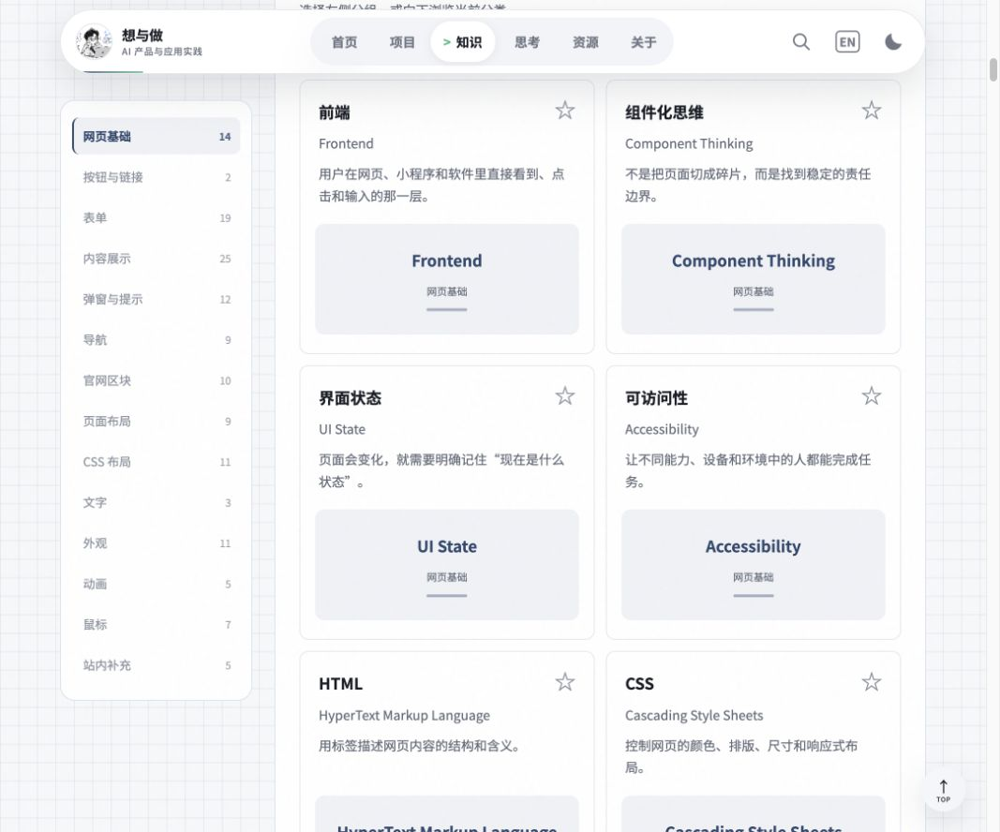

# 想与做 · Vibe Hub

**把 AI 想明白，也把它做出来。**

一个持续迭代的个人学习与实践记录网站。把学习 AI、产品与开发时遇到的概念、做过的项目、阶段思考和可复用资源放在一起，留下从问题到实践、再到复盘的过程。

[项目阶段](#当前阶段) · [本地运行](#本地运行) · [内容维护](#内容维护) · [迭代计划](docs/plans/2026-09-15-knowledge-visual-learning.md) · [文档索引](docs/README.md)



## 当前阶段

截至 **2026-09-15**，项目已形成「首页 / 项目 / 知识 / 思考 / 资源 / 关于」六个主要栏目，正在从基础内容展示推进到更清晰的阅读路径和知识可视化。

| 栏目与能力 | 当前实现 |
| --- | --- |
| 首页 | 个人表达、当前项目、关于网站，以及知识、思考、资源预览；共用布局、字体与颜色规范 |
| 项目 | 项目总览、项目档案、阶段记录；收录想与做、滑一叠、AwakeKeeper 三个开发实践及一个方案探索 |
| 知识 | 术语目录与系列学习分开；一级分类横向展示，二级分组在左侧，随正文滚动标记当前位置 |
| 知识卡片 | 统一标题、英文名、摘要与静态预览；部分概念使用按钮、开关、布局、字体、颜色或流程示意 |
| 阅读与收藏 | 本地收藏、当前分类内的收藏筛选、搜索、目录返回状态，以及术语上一篇／下一篇入口 |
| 思考与资源 | 栏目介绍、分类浏览与详情入口；明确区分已有正文、整理中的选题和待补充资源 |
| 全站体验 | 统一品牌头像、中英文切换、深浅主题、搜索与响应式布局 |

**当前是个人站点的持续迭代版本。** 静态预览不等于完整交互演示；收藏和学习记录保存在当前浏览器，没有账号与跨设备同步。项目介绍中的开发验证状态不代表这些独立项目已经公开发布。

## 页面预览

以下为当前分支的本地实际运行截图，非设计稿；不同屏幕宽度会调整布局。

### 项目：记录成果，也记录过程

项目档案描述当前全貌，阶段记录说明问题、选择、验证依据与思考。独立项目的代码仍在各自仓库或本地项目中，本仓库维护它们的介绍与记录。



### 知识：查概念，沿目录继续阅读

先选择知识方向，再通过左侧分组浏览。卡片提供轻量视觉提示，收藏按钮独立于详情链接。



## 本地运行

需要支持 ES Modules 与内置测试运行器的 Node.js（建议 Node.js 22 或更新版本），以及现代浏览器。

```bash
git clone https://github.com/Yiyang0659/vibe-hub.git
cd vibe-hub
# 本次阶段成果所在分支；main 尚未合并时请先切换
git switch codex/knowledge-navigation
npm run dev
```

打开 **http://localhost:4173/#/home**。默认端口被占用时，可运行 `PORT=4175 npm run dev`。

项目使用原生 HTML、CSS、JavaScript ES Modules，没有构建步骤和第三方运行时依赖，无需安装依赖即可执行以上命令。使用 HTTP 服务访问，不要直接双击 `index.html`。

```bash
npm run check   # JavaScript 语法检查
npm test        # Node.js 单元与集成测试
```

本次阶段核验：94 个源文件语法检查通过，109 项测试通过。后续测试数量会随功能变化。

## 技术与目录

```text
vibe-hub/
├── index.html          # 页面外壳与浏览器入口
├── src/
│   ├── app/            # 路由、导航、语言、主题与浏览返回状态
│   ├── features/       # 首页、项目、知识、思考、资源、关于等栏目
│   ├── shared/         # 公共组件、数据、搜索和本地状态
│   └── styles/         # 全站样式与视觉基础
├── assets/             # 网站使用的插画与项目图片
├── tests/              # 功能、公共能力与集成测试
├── scripts/            # 开发检查及内容维护脚本
└── docs/               # 项目、设计、工程、内容与迭代文档
```

页面使用 Hash 路由；收藏、主题及学习状态沿用 `pkl-v3-state` 本地存储。语言相关内容由应用层与内容词典协作维护。静态部署时应保持目录结构与资源相对路径，详见[部署说明](docs/engineering/deployment.md)。

## 内容维护

| 要修改的内容 | 主要入口 |
| --- | --- |
| 首页内容与结构 | `src/features/home/`、`src/features/learning/home-sections.js` |
| 项目介绍与阶段记录 | `src/features/work/entries.js` |
| 术语、分类与系列正文 | `src/features/topics/` |
| 知识目录与卡片预览 | `src/features/columns/knowledge-browser.js`、`term-preview.js` |
| 思考与文章 | `src/features/notes/` |
| 工具、模板与外部资源 | `src/features/toolbox/`、`src/features/library/` |
| 关于页面 | `src/features/about/` |
| 双语内容 | `src/app/language.js`、`src/shared/content/` |
| 字体、颜色、间距和布局 | `src/styles/` 与栏目内样式 |

添加内容时沿用现有模板，区分已完成、验证中和计划内容；不要将设计图当作真实产品截图，也不要编造个人实践证据。参考[项目记录填写指南](docs/guides/project-records.md)与[内容维护指南](docs/guides/add-content.md)。

## 下一步

- [x] 知识目录层级与滚动定位
- [x] 卡片静态预览、本地收藏与筛选
- [x] 普通术语前后阅读入口，保留系列章节导航
- [ ] 按钮、开关、输入框、弹窗、字体、颜色、Flex、Grid、API、RAG 的完整交互样板
- [ ] 按知识类型逐步补齐演示、使用场景、易混淆概念与真实实践记录
- [ ] 扩展设备与无障碍验证；按需评估跨设备同步

详细范围与验收标准见[知识可视化迭代计划](docs/plans/2026-09-15-knowledge-visual-learning.md)，本次阶段变化见 [CHANGELOG](CHANGELOG.md)。

## 参考与反馈

知识目录组织参考 [VibeHub](https://vibe-hub.org/)，相关术语页面保留来源入口；本站的个人项目、学习记录和实现持续独立整理。参考站点与本仓库并非同一项目。

欢迎通过 [GitHub Issues](https://github.com/Yiyang0659/vibe-hub/issues) 提交问题，并附上复现步骤、页面地址和截图。提交改动前请执行语法检查与测试。

仓库当前未声明开源许可证；代码、内容和图片的再分发授权请先联系作者确认。
