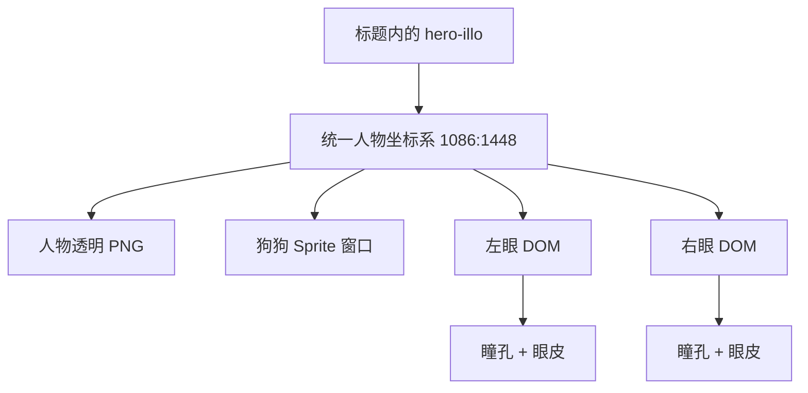
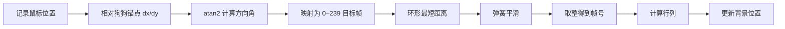
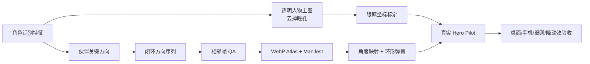

# OIL OIL 人物与狗狗交互：详细拆解与复现方案

研究日期：2026-09-05  
目标页面：[oiloil.org](https://www.oiloil.org/)

## 先说结论

OIL OIL 没有使用 Rive、Lottie、Canvas、WebGL 或实时 3D。它用的是一套“素材先拆对、代码只负责驱动”的轻量方案：

- 人物：一张 1086 × 1448 的透明 PNG，底图故意不画瞳孔；
- 眼睛：两个 DOM 瞳孔，跟随鼠标小幅移动，并用 CSS 眨眼；
- 狗狗：一张 3840 × 3600 的 WebP 图集，内含 16 × 15 = 240 个真实转向画面；
- 驱动：JavaScript 将鼠标方向换算为 0–239 帧，经过环形弹簧平滑后更新 `background-position`；
- 完整性：预加载、离屏暂停、移动端陀螺仪、iOS 权限和 reduced-motion 都做了处理。

所以，它看起来像“角色真的在看你”，不是因为跟随距离大，而是因为狗狗的头、眼睛和鼻口确实在逐帧改变朝向。

## 一、它的页面结构

真实结构可简化为：

```html
<span class="hero-illo" aria-hidden="true">
  <span class="hero-mascot-motion">
    
    <span class="hero-dog-sequence">
      <span class="hero-dog-sprite"></span>
    </span>
    <span class="hero-eye eye-left"><i></i></span>
    <span class="hero-eye eye-right"><i></i></span>
  </span>
</span>
```



这里最值得学的是：人物、眼睛、狗狗从一开始就是独立图层，而不是把一张完整场景图复制、遮罩、局部裁切。

## 二、人物素材的设计方法

[人物原图](https://www.oiloil.org/assets/hero/person.png)是 3:4 的纵向透明图。画面非常克制：高挑人物、挥手、圆眼镜、三缕头发、简单上衣、黑白线稿和极少灰色纹理。

它做了三个关键取舍：

1. 眼镜里没有瞳孔，网页可以干净地叠加动态眼睛；
2. 没有电脑、书、咖啡、卡片等环境元素，人物可以自然插入文字排版；
3. 人物只是作者气质的锚点，狗狗才是动态焦点。

人物本身只有轻微呼吸：5.4 秒循环，中点约上移 2px、旋转 -0.25°。入场时用 `clip-path` 从下到上揭示 1.5 秒，像人物从标题里长出来。

这也是它不像常见 Portfolio 模板的原因：人物不是右侧的“插画卡片”，而是主标题内部的一部分。

## 三、眼睛的实现

两只眼睛以人物画布为统一坐标系定位：

| 项目 | 数值 |
|---|---:|
| 左眼 | `left: 22.6%`, `top: 25.7%` |
| 右眼 | `left: 31.35%`, `top: 26.15%` |
| 眼睛容器 | 人物宽度的 `6.8%` |
| 瞳孔直径 | 眼睛容器的 `34%` |
| 最大横向移动 | ±3.2px |
| 最大纵向移动 | ±2.4px |

鼠标坐标先归一化到 `[-1, 1]`，再得到目标位移。当前瞳孔每帧只向目标靠近 14%：

```js
targetX = normalizedX * 3.2
targetY = normalizedY * 2.4
eyeX += (targetX - eyeX) * 0.14
eyeY += (targetY - eyeY) * 0.14
```

眨眼周期 5.6 秒，但闭眼只持续约整个周期的 1%。瞳孔在那一瞬间压扁、隐藏，眼皮横线出现。幅度小、缓动稳、闭眼短，所以不会有玩具眼球或惊悚感。

## 四、狗狗的核心：240 帧角度图集

[狗狗图集](https://www.oiloil.org/assets/hero/dog-turn/dog-look-angle-atlas.webp)的参数是：

| 参数 | 数值 |
|---|---:|
| 图集尺寸 | 3840 × 3600 |
| 网格 | 16 列 × 15 行 |
| 总帧数 | 240 |
| 单格尺寸 | 240 × 240 |
| CSS 背景缩放 | `1600% 1500%` |
| 网络体积 | 约 3.3 MB |

每一格都是真实画好的狗狗朝向。身体、大小和落点基本不变，只让头、眼睛、鼻口随角度变化。240 帧在逻辑上是一条首尾相接的圆环；16 × 15 只是把圆环装进一张图片的方法，不是“横向动作 × 纵向动作”的二维状态表。

浏览器只加载一张图，通过改变 `background-position` 显示某一格。这比请求 240 张图片稳定，也避免两张大透明图交叉淡化带来的重影。

## 五、鼠标如何控制狗狗

狗狗的视线锚点位于人物容器的约 `(62%, 71%)`。运行时流程如下：



近似代码是：

```js
angle = Math.atan2(pointerY - anchorY, pointerX - anchorX)
target = wrap240(phase + angle / (Math.PI * 2) * 240)
current = circularSmoothDamp(current, target, velocity, 0.11, 460, dt)

frame = wrap240(Math.round(current))
col = frame % 16
row = Math.floor(frame / 16)
backgroundX = col / 15 * 100
backgroundY = row / 14 * 100
```

有两个决定手感的点：

- 环形最短路径：239 → 0 只走一帧，不会反向绕一整圈；
- 临界阻尼弹簧：平滑时间约 0.11 秒，并限制最大速度和单帧 `dt`，不会迟钝，也不会在掉帧后猛跳。

实测把鼠标放到舞台四侧时，狗狗会落到约第 221、26、75、157 帧。帧号由鼠标与锚点的真实夹角决定，不是四个方向的硬编码开关。

## 六、加载和性能处理

它的 `pointermove` 只记录坐标，不在事件里反复写 DOM；所有视觉更新集中在 `requestAnimationFrame` 中。状态稳定后会停止继续调度。

此外还有：

- `IntersectionObserver`：Hero 离屏后恢复默认姿态并停止计算；
- `ResizeObserver`：窗口或排版变化后更新几何位置；
- `prefers-reduced-motion`：关闭连续追踪，显示静态姿态；
- 桌面细指针：使用鼠标方向；
- 手机：使用设备 `beta/gamma` 方向，并适配屏幕旋转；
- iOS：需要时显示“开启体感”按钮，由用户点击请求权限；
- 卸载：移除监听器、取消 rAF。

人物 PNG 和狗狗图集都被高优先级预加载。加载层会等待资源完成或 6 秒超时，并留出最短展示时间，避免大图集解码前出现空白、闪帧或错误格子。

要注意：3.3 MB 是传输体积，3840 × 3600 的 RGBA 图像解码后理论内存约 55.3 MB。它适合用作唯一主视觉，不适合一页同时放很多套。

## 七、它为什么显得自然，而不是刻意

- 人物极简黑白，狗狗温暖细腻，主次非常清楚；
- 狗狗身体基本不动，只改变注意力方向；
- 没有“互动角色”“AI 助手”之类的说明文字；
- 整个插画 `pointer-events: none` 且 `aria-hidden: true`，不抢占页面功能；
- 角色嵌入主标题，不额外制造 Dashboard 卡片；
- 呼吸、眨眼、转头三种运动频率不同，但幅度都很小。

访客会感到作者和伙伴“在场”，却不会觉得页面在演示一个功能组件。

## 八、为什么你当前版本无法靠微调还原

| 维度 | 当前项目 | OIL OIL |
|---|---|---|
| 人物底图 | 1448 × 1086 横向完整场景 | 1086 × 1448 纵向极简人物 |
| 眼睛 | 原图已有眼睛，再覆盖 DOM 眼睛 | 原图无瞳孔，只用 DOM 瞳孔 |
| 伙伴 | 从同一张合成图中遮罩、复制 | 独立 240 帧透明图集 |
| 动作 | 整张局部图平移、旋转 | 真实头部/视线逐帧转向 |
| 构图 | 右侧独立插画舞台 | 嵌入主标题 |
| 动画循环 | 页面存活时持续 rAF | 有变化才运行，离屏停止 |

当前 `person-hero.png` 同时包含人物、电脑、书、植物、杯子、助手和文字。页面把同一张图片复制一遍，再用椭圆裁出助手、给主图挖洞。它天然会出现边缘接缝、重复阴影和“贴纸在晃”的感觉。

因此，我之前把当前方案描述为接近 OIL OIL，是不准确的。真正的差距在素材架构，继续调 mask、定位或位移参数无法根治。

## 九、按同样方法重做：你需要提供什么

### 1. 一张真正可交互的人物主图

- 3:4 透明 PNG，建议至少 1080 × 1440；
- 保留你的识别点：黑发、方框眼镜、浅色外套/连帽衫，可保留斜挎带；
- 取消电脑、书、杯子、植物、便利贴和背景网格；
- 眼镜、眼白可以保留，但必须去掉瞳孔；
- 只选一个姿势：挥手、探头或靠边站；
- 必须是真 Alpha，浅色和深色背景上都没有白边。

### 2. 一套独立的蓝色 AI 小伙伴方向帧

- 固定 240 × 240 画布、相同中心和底部锚点；
- 身体大小、颜色、阴影和轮廓不漂移；
- 主要改变眼睛、脸和轻微轮廓朝向；
- 完全复刻：240 帧、16 × 15；
- 先做 Pilot：可先用 64 或 96 帧验证角色一致性；
- 最终交付透明 WebP atlas、帧清单和默认静态 PNG。

对于简单云朵角色，2D 骨骼、矢量变形或 3D 简模会比逐张 AI 生图更稳定。若使用生成式视频，也必须固定角色身份、画布和锚点，并逐帧检查闪烁、轮廓漂移和首尾接缝。

## 十、推荐的实际制作顺序



落到当前项目的顺序应当是：

1. 停用当前合成大图和椭圆裁切助手；
2. 先接入新人物透明图，确认它与主标题的排版；
3. 标定两只眼睛，完成小幅追踪和眨眼；
4. 接入伙伴图集，完成角度映射、最短路径和弹簧；
5. 再加预加载、静态降级、离屏暂停和移动端策略；
6. 最后才加呼吸与入场揭示。

## 十一、验收标准

满足以下条件，才算真正采用 OIL OIL 的实现方式：

- 人物与伙伴是独立透明资源；
- 人物底图没有瞳孔；
- 伙伴有连续方向帧，而不是单图平移；
- 239 ↔ 0 帧跨界时走最短路径；
- 鼠标停住后画面稳定，rAF 也停止；
- Hero 离屏后不再计算；
- 冷缓存没有空白、闪帧和错误格子；
- reduced-motion 下是完整静态画面；
- 手机有静态降级或授权后的体感；
- 角色参与标题排版，而不是独立功能卡片。

## 研究边界与来源

当前站点的原始仓库没有公开，生产 sourcemap 也不可访问，因此无法确认作者具体使用了哪款绘图、绑定或生成工具。本文关于页面结构、尺寸、算法和行为的结论来自当前线上部署，可在以下第一方资源中核对：

- [OIL OIL 首页](https://www.oiloil.org/)
- [人物 PNG](https://www.oiloil.org/assets/hero/person.png)
- [狗狗角度图集](https://www.oiloil.org/assets/hero/dog-turn/dog-look-angle-atlas.webp)
- [当前 CSS](https://www.oiloil.org/_next/static/css/d304ca04e7424e67.css)
- [当前交互 bundle](https://www.oiloil.org/_next/static/chunks/393-7177f8329a504be3.js)
- [作者公开的 oil-motion 工作流](https://github.com/oil-oil/oil-motion)
- [oil-motion 运行时规范](https://github.com/oil-oil/oil-motion/blob/main/references/runtime.md)
- [oil-motion Alpha 图集流程](https://github.com/oil-oil/oil-motion/blob/main/references/minimax-spritesheet.md)

公开 `oil-motion` 的图集、rAF、预加载和 QA 方法与当前首页高度一致，可作为生产路线的旁证，但不能证明这个首页就是由该公开版本直接生成。

