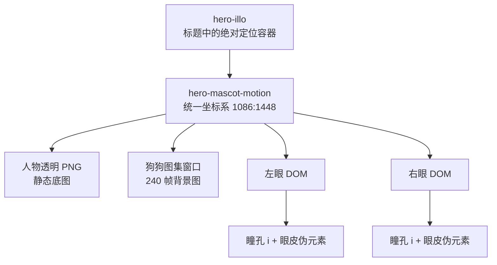
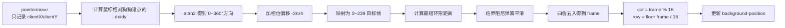
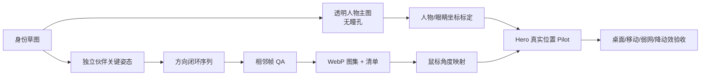

# OIL OIL 首页人物与宠物交互：研究底稿

研究日期：2026-09-05  
研究对象：[OIL OIL 首页](https://www.oiloil.org/)  
研究方法：实时页面 DOM/CSS 检查、生产 bundle 静态分析、真实鼠标与滚动测试、资源尺寸检查、作者公开动效工作流交叉验证。

> 说明：当前站点的原始仓库未公开，生产 sourcemap 返回 403。因此本文能准确还原页面当前部署的 DOM、样式、资源与运行时算法，但不能断言作者在设计软件或生成模型中的全部创作过程。涉及作者公开 `oil-motion` 工作流的内容会明确标注为“旁证/推断”。

## 1. 一句话结论

它不是 Rive、Lottie、Canvas、WebGL 或 3D 模型，而是一个非常克制的分层系统：

1. 一张透明人物 PNG，人物本身没有画瞳孔；
2. 两个 DOM 瞳孔跟随鼠标，并用 CSS 伪元素眨眼；
3. 一张 16 × 15、共 240 帧的透明狗狗 WebP 图集；
4. JavaScript 把鼠标相对狗狗的位置换算成角度，再通过弹簧算法平滑选择图集帧；
5. `requestAnimationFrame`、`IntersectionObserver`、`ResizeObserver`、预加载、移动端陀螺仪和 reduced-motion 共同保证体验完整。

最关键的不是“鼠标跟随”代码，而是**素材在生产时就按交互需求拆好了**。人物、瞳孔、狗狗不能先合成一张完整插画，再靠 CSS 补救。

## 2. 真实结构：只有四层 DOM

首页实际结构可以概括为：

```html
<span class="hero-illo" aria-hidden="true">
  <span class="hero-mascot-motion">
    
    <span class="hero-dog-sequence">
      <span class="hero-dog-sprite"></span>
    </span>
    <span class="hero-eye eye-left"><i></i></span>
    <span class="hero-eye eye-right"><i></i></span>
  </span>
</span>
```



页面没有为这一角色系统创建 `canvas`、`video` 或 3D 节点；扫描当前首页加载的 8 个 Next.js chunk，也没有发现 Lottie、Rive、Three.js、WebGL 或 Canvas 动画依赖。其核心代码可直接在当前部署的[交互 bundle](https://www.oiloil.org/_next/static/chunks/393-7177f8329a504be3.js)与[样式文件](https://www.oiloil.org/_next/static/css/d304ca04e7424e67.css)中验证。

## 3. 人物是怎么设计的

人物素材是[透明 PNG](https://www.oiloil.org/assets/hero/person.png)，原始尺寸 1086 × 1448，正好是 3:4 的纵向构图。人物只保留：

- 极细黑线、白色填充和少量灰色铅笔纹理；
- 高挑身体、挥手手臂、圆眼镜、三缕头发、简单 T 恤；
- 眼镜里**没有画瞳孔**，给网页里的两个 DOM 瞳孔留出干净区域；
- 没有电脑、书、咖啡、便利贴等场景物件，人物只是标题中的一个“活标点”。

人物图本身只做一条很轻的呼吸动画：变换原点在 `31% 82%`，5.4 秒循环；中点大约上移 2px、旋转 -0.25°。这不是主交互，只用于避免静态贴纸感。

人物容器不是右侧独立卡片，而是嵌在主标题内部：桌面宽度最大约 330px，底部略向下溢出，入场时通过 `clip-path: inset(100% 0 0)` 到 `inset(0)` 做 1.5 秒的向上揭示。因此人物和文字属于同一个视觉句子，而不是“左文案 + 右插画”的模板化 Hero。

## 4. 眼睛为什么自然

每只眼睛都是一个按人物坐标系百分比定位的小容器：

| 元素 | 位置/尺寸 |
|---|---|
| 左眼 | `left: 22.6%`, `top: 25.7%` |
| 右眼 | `left: 31.35%`, `top: 26.15%` |
| 眼眶容器 | 人物宽度的 `6.8%`，正方形 |
| 瞳孔 | 眼眶容器宽度的 `34%`，黑色圆形 |

鼠标在人物容器中的相对位置被归一化到 `[-1, 1]`，目标位移范围只有横向 ±3.2px、纵向 ±2.4px。每帧用 0.14 的插值系数逼近目标，而不是直接跳过去：

```js
targetX = normalizedX * 3.2
targetY = normalizedY * 2.4
eyeX += (targetX - eyeX) * 0.14
eyeY += (targetY - eyeY) * 0.14
```

眨眼周期是 5.6 秒，但闭眼只占约 46%–47% 的极短区间：瞳孔纵向压扁并隐藏，眼睛容器的 `::after` 黑色横线同时出现。自然感来自“移动幅度小、缓动稳定、眨眼短”，不是夸张位移。

## 5. 狗狗不是移动，而是在真实转头

狗狗使用[透明 WebP 角度图集](https://www.oiloil.org/assets/hero/dog-turn/dog-look-angle-atlas.webp)：

- 图集尺寸：3840 × 3600；
- 网格：16 列 × 15 行；
- 总帧数：240；
- 每格：240 × 240；
- 当前传输体积约 3.3 MB；
- CSS：`background-size: 1600% 1500%`。

240 个格子不是二维“上下 × 左右”状态表，而是一条首尾闭合的**环形角度序列**。每一帧里狗都保持坐姿和大致锚点，只让头、眼睛、鼻口朝向逐渐变化。这就是为什么它看起来是在“看鼠标”，而不是一张贴纸跟着鼠标漂。

图集只请求一次。运行时通过 `background-position` 露出对应格子，不会创建 240 个 ``，也不会用两张大图交叉淡化。

## 6. 鼠标如何变成狗狗帧

狗狗的计算锚点位于人物容器内部约 `(62%, 71%)`。算法流程如下：



核心逻辑可近似写成：

```js
angle = atan2(pointerY - anchorY, pointerX - anchorX)
target = wrap240(phase + angle / TAU * 240)
current = circularSmoothDamp(current, target, velocity, 0.11, 460, dt)

frame = wrap240(round(current))
col = frame % 16
row = floor(frame / 16)
x = col / 15 * 100
y = row / 14 * 100
```

这里有两个很重要的细节：

1. **环形最短距离**：从 239 帧去 0 帧只走 1 格，不会倒着转 239 格；
2. **弹簧而非普通 lerp**：平滑时间约 0.11 秒、最大速度约 460，`dt` 上限为 1/30 秒，掉帧后不会突然飞越很多帧。

实际把鼠标放到舞台四侧时，观测到的典型结果是：左侧约第 221 帧、上方约第 26 帧、右侧约第 75 帧、下方/默认约第 157 帧。具体序号与鼠标相对锚点的真实角度有关，不应把这四个数字硬编码为四个方向。

## 7. 为什么性能没有看起来那么重

它没有在每次 `pointermove` 里直接改 DOM。事件只记录目标坐标，写入集中在 `requestAnimationFrame` 中，而且状态稳定后停止继续调度。

同时还有：

- `IntersectionObserver`：Hero 离开视口后停止响应并恢复默认状态；
- `ResizeObserver`：布局变化后重新计算容器几何；
- `prefers-reduced-motion`：关闭连续跟随，保留静态状态；
- `pointer: fine` 与桌面宽度判断：桌面使用鼠标；
- 设备方向：移动端用 `beta/gamma`，并处理屏幕 0/90/180/270° 旋转；
- iOS 权限按钮：需要时显示“开启体感”，必须由用户手势请求；
- 清理逻辑：卸载时移除监听器并取消 rAF。

图集虽然网络请求只有约 3.3 MB，但 3840 × 3600 的 RGBA 纹理解码后理论上约占 55.3 MB 内存。因此这种路线适合一个主视觉，不适合页面上同时堆很多套大图集。

## 8. 加载策略

人物 PNG 和狗狗图集都在 `<head>` 中高优先级预加载。页面加载层会等待资源完成，与 6 秒超时竞争，并至少显示约 520ms；退出动画约 620ms。这样做主要是为了避免 3.3 MB 图集尚未解码时角色突然跳帧或闪现。

作者公开的 [`oil-motion`](https://github.com/oil-oil/oil-motion) 工作流进一步规定：透明交互角色优先走 `alpha-atlas`，输入只更新目标值，渲染集中在 rAF；图集需要统一单元格、预加载并等待 `Image.decode()`，离屏停止计算，reduced-motion 使用静态帧。它与当前站点的实现高度一致，可以作为生产方法的旁证，但公开资料不能证明首页就是用这个公开 skill 直接生成的。

## 9. 视觉设计为什么不“刻意”

这个角色系统真正高明的地方是克制：

- 人物是极简、黑白、细线，作为作者身份锚点；
- 狗更温暖、更细腻，是唯一真正“活起来”的区域；
- 狗的身体几乎不移动，只改变注意力方向；
- 整套角色没有独立卡片、说明文字、按钮或“我是 AI 助手”的标签；
- `pointer-events: none`、`aria-hidden: true`，它不抢交互权，也不承担功能任务；
- 人物从标题中长出来，访客先读到一句话，再自然注意到角色。

所以访客会感觉“这里有一个作者和他的伙伴”，却不会感觉页面在刻意展示一个互动组件。

## 10. 你当前版本为什么不像

当前项目的实现与 OIL OIL 的差异不是审美参数，而是素材架构：

| 维度 | 当前项目 | OIL OIL |
|---|---|---|
| 原始人物 | 1448 × 1086 横向完整场景图 | 1086 × 1448 纵向极简人物 |
| 眼睛 | 原图已有眼睛，再叠 DOM 眼睛 | 原图主动留白，只由 DOM 画瞳孔 |
| 伙伴 | 从同一张合成图中遮罩、裁切、复制 | 独立 240 帧透明图集 |
| 伙伴动作 | 整块平移 ±4/±3px并轻旋转 | 真实头部/视线方向逐帧变化 |
| 构图 | 独立右侧插画舞台 | 嵌入主标题内部 |
| rAF | 页面存活期间持续循环 | 有变化时才运行，离屏停止 |
| reduced motion | 仍立即跟随目标 | 回到静态默认状态 |

当前 `person-hero.png` 同时包含人物、电脑、书、植物、杯子、助手和文字。代码又把同一张图复制一遍，用椭圆 `clip-path` 裁出助手，并在主图上用径向 mask 挖洞。这会天然产生边缘接缝、重复阴影、构图拥挤和“局部贴纸在移动”的感觉。继续调整 mask、位置或位移范围，只能让补丁更复杂，不能得到真实转向。

## 11. 按它的方法重做，你需要准备什么

### A. 人物主图

交付一张 3:4 左右的透明 PNG，建议 1080 × 1440 或更高：

- 只保留你的识别锚点：黑发、方框眼镜、浅色外套/连帽衫，可保留一条斜挎带；
- 取消电脑、书、杯子、植物、便利贴、背景网格和大面积装饰；
- 眼镜和眼白可以画，但**瞳孔必须去掉**；
- 姿势选择挥手、探头、靠边站中的一种；
- 四周真实 Alpha，不要白底抠图；
- 按最终 Hero 尺寸 × DPR 验收边缘清晰度。

### B. 独立伙伴

不要从人物合成图中裁。为你的蓝色 AI 小伙伴单独制作一条闭环方向序列：

- 固定 240 × 240 画布与同一中心/底部锚点；
- 身体轮廓、颜色、亮度、阴影和大小每帧一致；
- 只让眼睛、脸和少量轮廓随角度变化；
- 若要完全复刻手感：240 帧，16 × 15；
- 若优先控制成本：先做 64 或 96 帧 Pilot，确认方向连续后再决定是否加密；
- 打包为单张透明 WebP atlas，并另存一张默认静态 PNG 作为降级。

连续帧可采用 2D/2.5D 角色绑定、3D 简模渲染，或生成式视频转序列；但无论用什么工具，都必须先固定身份、画布和锚点，再做相邻帧接触表检查。对简单云朵角色，矢量/2D 骨骼或 3D 简模通常比逐张 AI 生成更稳定。

### C. 页面接入

推荐按以下顺序实现：

1. 用透明人物 PNG 替换当前横向合成图；
2. 在人物坐标系里重新标定两只眼睛；
3. 用独立 atlas sprite 替换现在的助手裁切层；
4. 实现 `atan2 → 环形帧 → 弹簧 → background-position`；
5. 把角色从独立卡片搬到主标题边缘，让它参与排版；
6. 加预加载、静态降级、离屏暂停、ResizeObserver、reduced-motion；
7. 最后再加呼吸和入场揭示，不先堆装饰动画。



## 12. 建议的还原标准

只有同时满足以下条件，才算“按 OIL OIL 的方式做了”，而不是视觉近似：

- 人物与伙伴是独立透明资源；
- 人物底图没有瞳孔；
- 伙伴真的有连续方向帧，不是平移单图；
- 方向跨越首尾时走最短路径；
- 鼠标停住后动画会稳定并停止 rAF；
- Hero 离屏后不再计算；
- 冷缓存加载时没有空白、闪帧或错误格子；
- reduced-motion 下保持可接受的静态画面；
- 手机端有静态降级或获得授权后的体感控制；
- 角色嵌入内容排版，不再成为一个说明性功能卡片。

## 来源与证据账本

| 证据 | 支持的结论 |
|---|---|
| [OIL OIL 首页](https://www.oiloil.org/) | 当前视觉、DOM、运行时实测、响应式行为 |
| [人物 PNG](https://www.oiloil.org/assets/hero/person.png) | 人物透明素材、尺寸、无瞳孔设计 |
| [狗狗角度图集](https://www.oiloil.org/assets/hero/dog-turn/dog-look-angle-atlas.webp) | 16 × 15、240 帧、透明方向序列 |
| [当前 CSS](https://www.oiloil.org/_next/static/css/d304ca04e7424e67.css) | 尺寸、定位、呼吸、眨眼、图集背景、响应式与 reduced-motion |
| [当前交互 bundle](https://www.oiloil.org/_next/static/chunks/393-7177f8329a504be3.js) | 鼠标角度映射、环形最短路径、弹簧、移动端方向、观察器与清理逻辑 |
| [作者公开 oil-motion 仓库](https://github.com/oil-oil/oil-motion) | Alpha atlas、生产门槛、运行时和 QA 方法的旁证 |
| [oil-motion 运行时规范](https://github.com/oil-oil/oil-motion/blob/main/references/runtime.md) | rAF、预加载、图集切帧、离屏暂停、移动端权限、性能原则 |
| [oil-motion 图集流程](https://github.com/oil-oil/oil-motion/blob/main/references/minimax-spritesheet.md) | Alpha 帧清理、稳定、WebP 图集打包和交付结构 |

